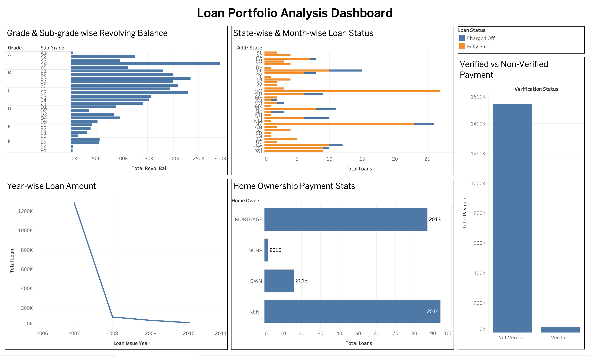

# 📊 Finance Loan Analysis Dashboard

## 📌 Project Overview

This project analyzes loan portfolio data using **MySQL** and **Tableau**. The objective was to clean the data, perform SQL analysis, and build an interactive dashboard to derive business insights.

---

## 🛠️ Tools Used

- MySQL
- SQL
- Tableau Public

---

## 📂 Dataset

The project uses two datasets:

- Finance_1
- Finance_2

Both datasets were joined using the **ID** column.

---

## 🧹 Data Cleaning

- Handled missing values
- Converted text columns into DATE format
- Changed incorrect data types
- Cleaned and validated data before analysis

---

## 📈 KPIs

1. Year-wise Loan Amount Statistics
2. Grade & Sub-grade Wise Revolving Balance
3. Total Payment: Verified vs Non-Verified Borrowers
4. State-wise & Month-wise Loan Status
5. Home Ownership vs Last Payment Statistics

---

## 📊 Dashboard Preview



---

## 💡 SQL Concepts Used

- INNER JOIN
- GROUP BY
- Aggregate Functions
- SUM()
- COUNT()
- MIN()
- MAX()
- YEAR()
- DATE Functions

---

## 🎯 Key Insights

- Loan amounts were analyzed year-wise.
- Revolving balance was compared across grades and sub-grades.
- Payment behavior was analyzed based on verification status.
- Loan distribution was analyzed across states and months.
- Home ownership categories were compared using payment statistics.

---

## 📁 Project Structure

```text
Finance-Loan-Analysis
│
├── README.md
├── SQL_Queries.sql
├── Dashboard.png
├── Loan_Analysis_Dashboard.twb
└── Dataset
```

## 👤 Author

Akash
